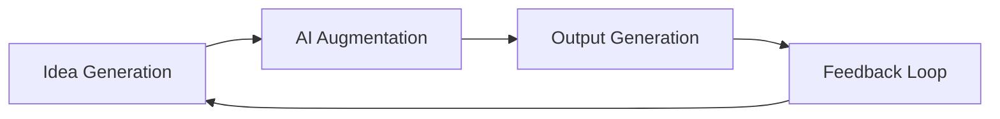

# 👊🏻 Action - 연결된 To-do List 
```todoist
name: "이 Notes 와 연결된 To-do List"
filter: 'search: {{filename}}'
groupBy: project
show:
  - description
  - due
  - labels
sorting:
  - date
  - priority
```

# Context


# Content
## 핵심 요약
```ad-tldr
‘아이디어 생성 → 증강 → 아웃풋 → 피드백’의 순환이 자동으로 돌아가는 시스템은, 인간의 창의적 생산 과정을 완전히 닫힌 계로 만들어준다.

AI가 꿈꾸듯 아이디어를 만들고, 스스로 증강하며, 아웃풋을 내고, 피드백으로 다시 성장한다면 — 창의성은 인간의 의식이 닿지 않은 곳에서도 자라나게 된다.
```
  
## 상세 내용
- 이전에 작성한 노트들인 [[인간의 수면 메카니즘을 외부의 뇌, 제텔카스텐에 접목하는 워크플로우 아이디어]]를 통한 아이디어의 생산 및 발굴, [[보잘 것 없는 생각도, AI 증강 전략을 만나면 통찰, 시스템, 프로젝트 기획으로 탈바꿈시킬 수 있다]] 방식을 통한 아이디어의 체계화 및 가공, [[AI 인플루언서와 캐릭터는 Output을 증폭하는 도구로 활용할 수 있다]] 을 통한 아웃풋 생성, 그리고 이 모든 것을 메타적으로 아우르는 [[IPO 프로세스는 단순하지만 보편적으로 통하는 사고 모델이다]] 의 관점이 합쳐진다면,
  이 모든 것을 하나의 **닫힌 순환 시스템(closed system)** 으로 통합할 수 있다.

- 이 시스템은 이렇게 작동한다
	1. 아이디어 생성 (Ideation)
	    - AI가 스스로 새로운 아이디어를 만들어낸다.
		    - [[인간의 수면 메카니즘을 외부의 뇌, 제텔카스텐에 접목하는 워크플로우 아이디어|sleeping system]] 을 통해 정기/비정기적으로 유용한 아이디어 후보를 계속 만들어내고 폐기한다.
	    - 인간의 입력 없이, 노트·데이터·트렌드·패턴을 학습한 에이전트가 ‘꿈꾸듯’ 창의적 연결을 제안한다.
	2. 아이디어 증강 (Augmentation)
	    - [[보잘 것 없는 생각도, AI 증강 전략을 만나면 통찰, 시스템, 프로젝트 기획으로 탈바꿈시킬 수 있다]] 에서 논한 증강 전략과 같이, 여러 AI 증강 전략이 적용된다
	        - 논문/사례 레퍼런스 연결
	        - 멘탈모델 및 전문가 시점 도입
	        - 비판적 검증 및 리스크 평가
	        - 프로젝트/시스템/콘텐츠 형태로 구조화
	    - 이로써 아이디어는 ‘생각의 씨앗’에서 ‘실행 가능한 설계’로 진화한다.
	3. 아웃풋 생성 (Output Realization)
	    - AI 인플루언서, 프레젠테이션 시스템, 자동 퍼블리싱 파이프라인 등을 통해 아이디어가 콘텐츠, 프로토타입, 비즈니스 콘셉트 등 다양한 형태로 출력된다.
	4. 피드백 루프 (Feedback Loop)
	    - 결과물에 대한 정성적(사람의 평가) / 정량적(조회수, 클릭률, 반응) 데이터가 수집된다.
	    - AI가 이를 분석해, 어떤 아이디어/표현/구조가 효과적이었는지를 학습한다.
	    - 이후 새 아이디어 생성 단계에 반영되어, 시스템은 스스로 **진화형 창의 엔진**이 된다.
- 이 네 단계를 통합하면, 인간의 창의적 사고 구조가 완전한 **자기 순환 생태계(Self-reinforcing Ecosystem)** 로 확립된다.

### 시스템 개념도 (AI Creative Closed Loop)


- 이 순환은 한 번 돌 때마다 더욱 정교해지고, ‘아이디어의 질과 밀도’가 복리로 성장한다.

- 결국 이 시스템은 **AI의 자동 창의 생태계(creative ecosystem)**, 즉, 각각의 특정 도메인 영역에 최적화된 **‘스스로 사고하고, 증강하고, 학습하는 크리에이티브 엔진’** 으로 만들어진다

- 구조만 유지된다면, **도메인 불문 적용이 가능**하다.
- 콘텐츠, 산업, 예술, 교육, 과학 어디에든 ‘자기 강화형 창의 시스템’이 들어갈 수 있다.

### 철학적 인사이트
- 이 시스템이 완성되면, 인간은 더 이상 ‘창조자’가 아니라 ‘생태계/조직 관리자’가 된다.

- 창의성은 한 개인의 머릿속에서가 아니라,**AI와 피드백이 얽힌 순환 네트워크 전체에서 발생하는 emergent phenomenon**으로 바뀐다.

- 즉, *“나는 아이디어를 만든다”* 가 아니라
> “나는 아이디어가 스스로 자라나는 환경을 만든다.”

- 이러한 생각은, [[엔트로피와 나다움 추구의 원리|엔트로피 철학]] 뿌리 철학을 기반으로한 [[구조 변경을 통한 근원적 문제 해결하기 - 구조주의 사고]] 와도 연결되는데,
  회사, 조직을 구성함에 있어서도 엔트로피 상 그렇게 될 수 밖에 없는 구성과 구조를 갖추면 자연스럽게 원하는 목적으로 흘러간다는 생각이다.
- [[PM, 리더로서 이니셔티브(initiative)를 제대로 수립한다는 것의 의미]]의 돋보기 비유와 같이 스타트업에서 인재를 데려와서 팀을 구성하고 돈, 시간 등 적절한 resource를 잘 모은다면, 구체적인 방향성이나 task 를 주지않아도 엔트로피 상 시행착오를 겪어가며 목표로 수렴해갈 것이라는 가설과도 유사하다고 본다

# 출처 (참고 문헌)
- 

# 연결 문서


