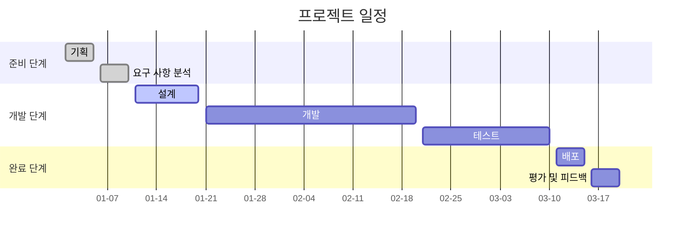

# Context


# Content
- obsidian publish 테스트 해보자

# 헤더 1
## 헤더 2

> 이건 어떻게 나오는가?


```ad-note
이건 이쁘게 잘 나오는가?
```


```chat
< Speaker 1 | 안녕하십니까?
> Speaker 2 | 이건 잘 나오나요?
```




# 출처 (참고 문헌)
- 

# 연결 문서
- 