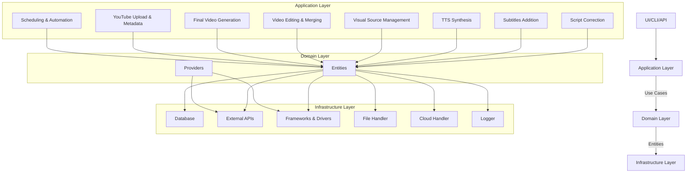
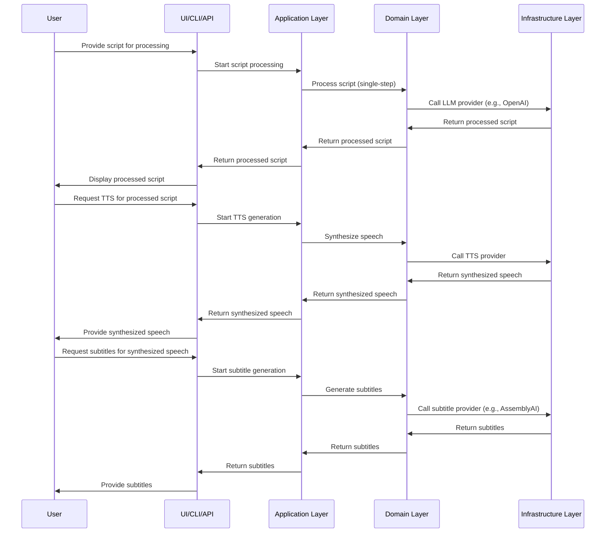
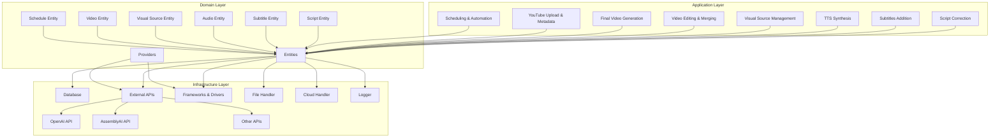
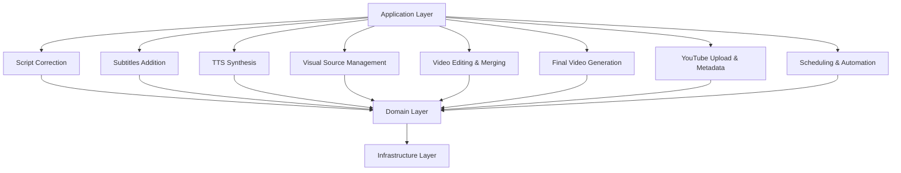

# Why Clean Architecture
- 시스템의 유연성과 유지보수성을 극대화하기 위해 클린 아키텍쳐 선택
- 비즈니스 로직과 외부 의존성을 명확히 분리하여 각 레이어를 독립적으로 개발하고 테스트
- 시스템의 확장성과 테스트 용이성을 높여서 지속 개발하기 위한 토대를 구축

# 1) 아키텍쳐 다이어그램 (Architecture Diagram)
## Key Points
- 전체 시스템 구조 확인
	- 시스템의 주요 레이어 확인 가능
	- UI/CLI/API, Application Layer, Domain Layer, Infrastructure Layer
- 레이어 간 의존성 확인
## Hidden Details
- 각 레이어 내부의 세부 모듈
- 데이터 흐름의 상세
	- 데이터가 각 레이어를 통과하면서 어떻게 변환되는지 상세히 표시하지 않음


# 2) 데이터 흐름 설계 (Sequence Diagram)
## Key Points
- 프로세스 흐름
	- 사용자 입력에서 최종 출력까지의 데이터 흐름을 시각적으로 표현
- 모듈 간 데이터 전달
	- 각 모듈 간에 데이터가 어떻게 이동하는지 명확히 확인 가능
## Hidden Details
- 데이터 형식
	- 데이터가 각 단계에서 어떤 형식으로 전달되는지 구체적인 설명 없음
- 에러 처리
	- 각 단계에서 발생할 수 있는 에러와 처리 방법 표현하지 않음


# 3) 통합 포인트 정의 다이어그램 (Integration Points Diagram)
## Key Points
- 모듈 간의 인터페이스
	- 각 모듈 간의 상호작용 지점을 명확히 확인 가능
- 데이터 의존성
	- 어떤 모듈이 어떤 데이터를 필요로 하고, 어떤 데이터를 출력하는지 확인 가능
## Hidden Details
- 구체적인 인터페이스 구현
	- 각 인터페이스가 어떻게 구현되는지 (예: 함수 호출, API 형식 등) 구체적인 설명 없음
- 비동기/동기 처리
	- 데이터 전달이 비동기적으로 이루어지는지 동기적으로 이루어지는지에 대한 설명 없음



# 4) 모듈 분할 다이어그램
> 업데이트 예정

# 5) Application Layer Diagram
# 6) Domain Layer Diagram
# 7) Infrastructure Layer Diagram


# 디렉토리 구조
## 주요 파일 설명
- `app/config.py`: 설정 파일 로더 모듈
- `app/config.yaml`: 설정 파일
- `app/presentation/`: 사용자 인터페이스 및 API 모듈
- `app/application/`: 주요 애플리케이션 로직 모듈
- `app/domain/`: 도메인 엔티티 및 인터페이스 정의
- `app/infrastructure/`: 인프라스트럭처 관련 모듈
- `tests/`: 테스트 모듈

```bash
project-root/
├── app/
│   ├── __init__.py
│   ├── config.py
│   ├── config.yaml
│   ├── presentation/
│   │   ├── __init__.py
│   │   ├── api.py
│   │   ├── cli.py
│   │   └── ui.py
│   ├── application/
│   │   ├── __init__.py
│   │   ├── final_video_generation.py
│   │   ├── prompt_generator.py
│   │   ├── scheduling_automation.py
│   │   ├── script_correction.py
│   │   ├── subtitles_addition.py
│   │   ├── tts_synthesis.py
│   │   ├── video_editing_merging.py
│   │   ├── visual_source_management.py
│   │   └── youtube_upload.py
│   ├── domain/
│   │   ├── __init__.py
│   │   ├── entities/
│   │   │   ├── __init__.py
│   │   │   ├── audio.py
│   │   │   ├── schedule.py
│   │   │   ├── script.py
│   │   │   ├── subtitle.py
│   │   │   ├── video.py
│   │   │   └── visual_source.py
│   │   ├── providers/
│   │       ├── __init__.py
│   │       ├── llm_provider.py
│   │       ├── subtitle_provider.py
│   │       ├── tts_provider.py
│   ├── infrastructure/
│   │   ├── __init__.py
│   │   ├── cloud_handler.py
│   │   ├── database.py
│   │   ├── external_apis/
│   │   │   ├── __init__.py
│   │   │   ├── assemblyai_subtitle_provider.py
│   │   │   ├── llm_provider_selector.py
│   │   │   ├── ollama_provider.py
│   │   │   ├── openai_provider.py
│   │   │   ├── openai_tts_provider.py
│   │   │   ├── provider_selector.py
│   │   ├── external_apis.py
│   │   ├── file_handler.py
│   │   ├── frameworks_drivers.py
│   │   ├── logger.py
│   │   ├── openai_handler.py
└── tests/
    ├── __init__.py
    ├── test_application/
    │   └── test_script_correction.py
    ├── test_domain/
    └── test_infrastructure/
        ├── __init__.py
        ├── test_cloud_handler.py
        ├── test_file_handler.py
        └── test_openai_handler.py
├── main.py
```


# 참고)
- 아래의 [mermaid.live](https://mermaid.live/edit#pako:eNptk8tuwyAQRX8FsUok9wdYRIrSh7rwyk6lSt4QmDioNrg81FZR_r1jsNM0xhsbOPeC7zBnKowEyqiDzwBawKPireV9owk-A7deCTVw7cnegV3OVsKqwe-MtSC8MjpDhINXvgO3lVLlkbquqh_tT-CUW66-KRd4V5lgBZRc8xZ60D7HSTBP4x66LcG2-FpCz0rzLpIvoMHy_IHeTajDAfZDZ7jM_fQJZOhwg23wpp9MEjfGRB42m0UyjCS7aYGsavj2BSm5_ZDmS6-T_F6VrO4jZGQiYLab1PdglN_Gy_6YJLldjHQ-bjaCZBukMkmXxyaHRSHYxJMkcGT12qPEFQl269l0oYyOuaoxMoIYQJxP-hwXDf4VlCXuVpiraE54LWHEIYn_MVE1XoIrvDP6qOx8S2hBe8CRkth059GgoZh-Dw1l-CnxOjS00RfkOB4FayMo8zZAQa0J7YmyI-8cjsIguZ_b9ToLmImxZerp2NqXX4eVX8M) 사이트 제공 웹 링크와 실제 markdown 중,
  publishing 하였을 때에 더 가독성이 좋은 방식 테스트 예정

[](https://mermaid.live/edit#pako:eNptk8tuwyAQRX8FsUok9wdYRIrSh7rwyk6lSt4QmDioNrg81FZR_r1jsNM0xhsbOPeC7zBnKowEyqiDzwBawKPireV9owk-A7deCTVw7cnegV3OVsKqwe-MtSC8MjpDhINXvgO3lVLlkbquqh_tT-CUW66-KRd4V5lgBZRc8xZ60D7HSTBP4x66LcG2-FpCz0rzLpIvoMHy_IHeTajDAfZDZ7jM_fQJZOhwg23wpp9MEjfGRB42m0UyjCS7aYGsavj2BSm5_ZDmS6-T_F6VrO4jZGQiYLab1PdglN_Gy_6YJLldjHQ-bjaCZBukMkmXxyaHRSHYxJMkcGT12qPEFQl269l0oYyOuaoxMoIYQJxP-hwXDf4VlCXuVpiraE54LWHEIYn_MVE1XoIrvDP6qOx8S2hBe8CRkth059GgoZh-Dw1l-CnxOjS00RfkOB4FayMo8zZAQa0J7YmyI-8cjsIguZ_b9ToLmImxZerp2NqXX4eVX8M)

# 연결 문서
- [[1. Requirements Specification]]
- [[3. Work Breakdown Structure]]