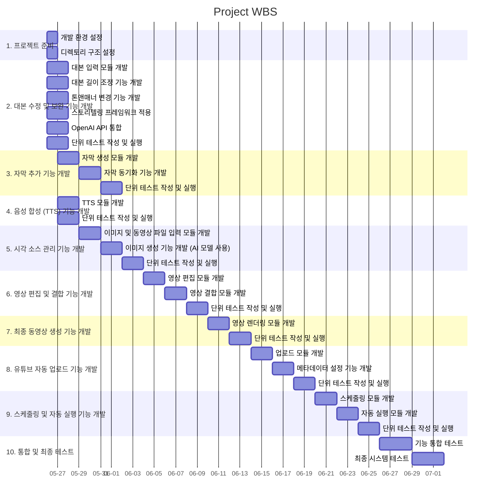

# WBS
> 업데이트 예정

```mermaid
gantt
    title Project WBS
    dateFormat  YYYY-MM-DD
    axisFormat  %m-%d

    section 1. 프로젝트 준비
    개발 환경 설정           :a1, 2024-05-26, 1d
    디렉토리 구조 설정       :a2, 2024-05-26, 1d

    section 2. 대본 수정 및 보완 기능 개발
    대본 입력 모듈 개발       :b1, 2024-05-26, 2d
    대본 길이 조정 기능 개발   :b2, 2024-05-26, 2d
    톤앤매너 변경 기능 개발    :b3, 2024-05-26, 2d
    스토리텔링 프레임워크 적용 :b4, 2024-05-26, 2d
    OpenAI API 통합         :b5, 2024-05-26, 2d
    단위 테스트 작성 및 실행  :b6, 2024-05-26, 2d

    section 3. 자막 추가 기능 개발
    자막 생성 모듈 개발       :c1, 2024-05-27, 2d
    자막 동기화 기능 개발     :c2, after c1, 2d
    단위 테스트 작성 및 실행  :c3, after c2, 2d

    section 4. 음성 합성 (TTS) 기능 개발
    TTS 모듈 개발           :d1, 2024-05-27, 2d
    단위 테스트 작성 및 실행  :d2, 2024-05-27, 2d

    section 5. 시각 소스 관리 기능 개발
    이미지 및 동영상 파일 입력 모듈 개발 :e1, after d2, 2d
    이미지 생성 기능 개발 (AI 모델 사용) :e2, after e1, 2d
    단위 테스트 작성 및 실행            :e3, after e2, 2d

    section 6. 영상 편집 및 결합 기능 개발
    영상 편집 모듈 개발       :f1, after e3, 2d
    영상 결합 모듈 개발       :f2, after f1, 2d
    단위 테스트 작성 및 실행  :f3, after f2, 2d

    section 7. 최종 동영상 생성 기능 개발
    영상 렌더링 모듈 개발     :g1, after f3, 2d
    단위 테스트 작성 및 실행  :g2, after g1, 2d

    section 8. 유튜브 자동 업로드 기능 개발
    업로드 모듈 개발         :h1, after g2, 2d
    메타데이터 설정 기능 개발 :h2, after h1, 2d
    단위 테스트 작성 및 실행  :h3, after h2, 2d

    section 9. 스케줄링 및 자동 실행 기능 개발
    스케줄링 모듈 개발       :i1, after h3, 2d
    자동 실행 모듈 개발       :i2, after i1, 2d
    단위 테스트 작성 및 실행  :i3, after i2, 2d

    section 10. 통합 및 최종 테스트
    기능 통합 테스트         :j1, after i3, 3d
    최종 시스템 테스트       :j2, after j1, 3d

```

# 연결 문서
- [[2. System Architecture]]